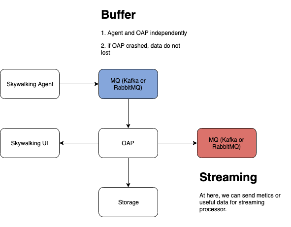

# Why doesn't SkyWalking involve MQ in its architecture?
This is often asked by those who are first introduced to SkyWalking. Many believe that MQ should have better performance and should be able to support higher throughput, like the following:

Here's what we think.

### Is MQ appropriate for communicating with the OAP backend?
This question arises when users consider the circumstances where the OAP cluster may not be powerful enough or becomes offline. 
But the following issues must first be addressed:
1. Why do you think that the OAP is not powerful enough? Were it not powerful, the speed of data analysis wouldn't have caught up with the producers (or agents). Then what is the point of adding new deployment requirements?
1. Some may argue that the payload is sometimes higher than usual during peak times. But we must consider how much higher the payload really is.
1. If it is higher by less than 40%, how many resources would you use for the new MQ cluster? How about moving them to new OAP and ES nodes?
1. Say it is higher by 40% or more, such as by 70% to 200%. Then, it is likely that your MQ would use up more resources than it saves. 
Your MQ would support 2 to 3 times the payload using 10%-20% of the cost during usual times. Furthermore, in this case, 
if the payload/throughput are so high, how long would it take for the OAP cluster to catch up? The challenge here is that well before it catches up, the next peak times would have come.

With the analysis above in mind, why would you still want the traces to be 100%, given the resources they would cost? 
The preferred way to do this would be adding a better dynamic trace sampling mechanism at the backend. When throughput exceeds the threshold, gradually modify the active sampling rate from 100% to 10%, which means you could get the OAP and ES 3 times more powerful than usual, while ignoring the traces at peak times.

### Is MQ transport recommended despite its side effects?
Even though MQ transport is not recommended from the production perspective, SkyWalking still provides optional plugins named
`kafka-reporter` and `kafka-fetcher` for this feature since 8.1.0. 

### How about MQ metrics data exporter?
The answer is that the MQ metrics data exporter is already readily available. The exporter module with gRPC default mechanism is there, and you can easily provide a new implementor of this module.
