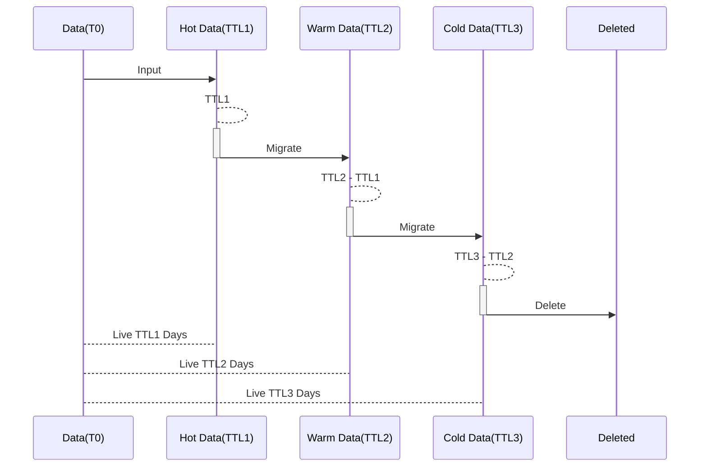

# Data Lifecycle Stages(Hot/Warm/Cold)

Lifecycle Stages provide a mechanism to optimize storage costs and query performance based on the time granularity of records/metrics,
specially if you require keep mass of data for a long time.

The data lifecycle includes hot, warm, and cold stages. Each stage has different TTL settings and Segment Creation Policies.
Each group of records/metrics can be automatically migrated and stored in different stages according to the configuration.

## Stages Definition
- **hot**: The default first stage for storing data. The data is the newest, can be updated(metrics), and is most frequently queried.
- **warm**: Optional, the second stage for storing data. The data is less frequently queried than the hot stage, can't be updated, and still performs well.
- **cold**: Optional, the third stage for storing data. The data is rarely queried and is stored for a long time. The query performance is significantly lower than the hot/warm stages data.

If necessary, you also can jump the warm stage, and only use hot and cold stages. Then the data will be moved to the cold stage after the TTL of the hot stage.

## Configuration Guidelines
The lifecycle stages configuration is under each group settings of the `bydb.yml` file, for example, the `metricsMin` group:

```yaml
  metricsMin:
    # The settings for the default `hot` stage.
    shardNum: ${SW_STORAGE_BANYANDB_GM_MINUTE_SHARD_NUM:2}
    segmentInterval: ${SW_STORAGE_BANYANDB_GM_MINUTE_SI_DAYS:1}
    ttl: ${SW_STORAGE_BANYANDB_GM_MINUTE_TTL_DAYS:7}
    enableWarmStage: ${SW_STORAGE_BANYANDB_GM_MINUTE_ENABLE_WARM_STAGE:false}
    enableColdStage: ${SW_STORAGE_BANYANDB_GM_MINUTE_ENABLE_COLD_STAGE:false}
    warm:
      shardNum: ${SW_STORAGE_BANYANDB_GM_MINUTE_WARM_SHARD_NUM:2}
      segmentInterval: ${SW_STORAGE_BANYANDB_GM_MINUTE_WARM_SI_DAYS:3}
      ttl: ${SW_STORAGE_BANYANDB_GM_MINUTE_WARM_TTL_DAYS:15}
      nodeSelector: ${SW_STORAGE_BANYANDB_GM_MINUTE_WARM_NODE_SELECTOR:"type=warm"}
    cold:
      shardNum: ${SW_STORAGE_BANYANDB_GM_MINUTE_COLD_SHARD_NUM:2}
      segmentInterval: ${SW_STORAGE_BANYANDB_GM_MINUTE_COLD_SI_DAYS:5}
      ttl: ${SW_STORAGE_BANYANDB_GM_MINUTE_COLD_TTL_DAYS:60}
      nodeSelector: ${SW_STORAGE_BANYANDB_GM_MINUTE_COLD_NODE_SELECTOR:"type=cold"}
```

1. **shardNum**: The number of shards for the group.
2. **segmentInterval**: The time interval in days for creating a new data segment.
- According to the freshness of the data, the `segmentInterval` days should: `hot` < `warm` < `cold`.
3. **ttl**: The time-to-live for data within the group, in days.
4. **enableWarmStage/enableColdStage**: Enable the warm/cold stage for the group.
- The `hot` stage is always enabled by default.
- If the `warm` stage is enabled, the data will be moved to the `warm` stage after the TTL of the `hot` stage.
- If the `cold` stage is enabled and `warm` stage is disabled, the data will be moved to the `cold` stage after the TTL of the `hot` stage.
- If both `warm` and `cold` stages are enabled, the data will be moved to the `warm` stage after the TTL of the `hot` stage, and then to the `cold` stage after the TTL of the `warm` stage.
- OAP will query the data from the `hot and warm` stage by default if the `warm` stage is enabled.
5. **nodeSelector**: Specifying target nodes for this stage.

For more details on configuring `segmentIntervalDays` and `ttlDays`, refer to the [BanyanDB Rotation](https://skywalking.apache.org/docs/skywalking-banyandb/latest/concept/rotation/) documentation.

## Procedure and The TTL for Stages
About the TTL can refer to [Progressive TTL](ttl.md).
The following diagram illustrates the lifecycle stages, assuming the TTL settings for hot, warm and cold stages are `TTL1, TTL2 and TTL3` days respectively:



- When the data is input, it will be stored in the hot stage and live for `TTL1` days.
- After `TTL1` days, the data will be migrated to the warm stage and live until `TTL2` days. **It means data will in this stage for (TTL2 - TTL1) days**.
- After `TTL2` days, the data will be migrated to the cold stage and live until `TTL3` days. **It means data will in this stage for (TTL3 - TTL2) days**.
- After `TTL3` days, the data will be deleted.
- The data will live for `TTL3` days in total.

## Querying
- According to the lifecycle stages configuration, OAP will query the data from the `hot and warm` stage by default if the `warm` stage is enabled.
Otherwise, OAP will query the data from the `hot` stage only.
- If the `cold` stage is enabled, for better query performance, you should specify the stage in the query and OAP will limit the query time range.


