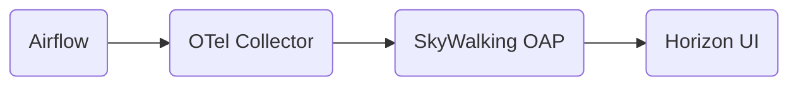
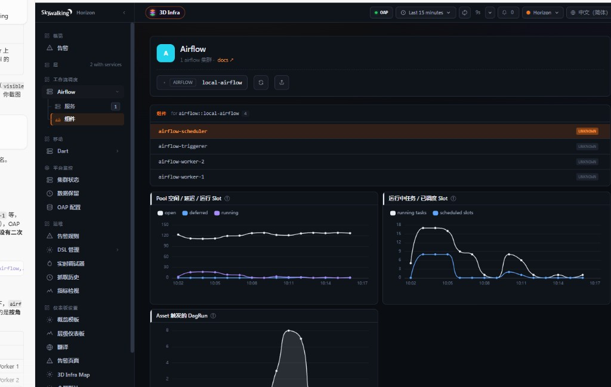

# Airflow monitoring

## Airflow metrics via native OpenTelemetry

SkyWalking receives Airflow metrics through Airflow's native OpenTelemetry exporter and the
[OpenTelemetry receiver](opentelemetry-receiver.md), then aggregates them with
[MAL](../../concepts-and-designs/mal.md).

## Data flow

1. Enable OpenTelemetry metrics in Airflow (`pip install 'apache-airflow[otel]'`, `otel_on = True`
   or standard `OTEL_EXPORTER_OTLP_*` environment variables).
2. Airflow **pushes** OTLP metrics to OpenTelemetry Collector.
3. OpenTelemetry Collector forwards metrics to SkyWalking OAP via OTLP gRPC exporter.
4. OAP applies MAL rules under `otel-rules/airflow/` and stores Service / Instance entities on
   `Layer: AIRFLOW`.



In the Horizon UI, Airflow appears under the **Workflow Scheduler** menu group.

## Setup

### 1. Enable Airflow OpenTelemetry metrics

Install the OTel extra and enable metrics export. See the
[Airflow metrics documentation](https://airflow.apache.org/docs/apache-airflow/stable/administration-and-deployment/logging-monitoring/metrics.html).

Example environment variables for Airflow 3.x:

```bash
pip install 'apache-airflow[otel]'

export OTEL_EXPORTER_OTLP_ENDPOINT=http://otel-collector:4318
export OTEL_EXPORTER_OTLP_PROTOCOL=http/protobuf
export OTEL_RESOURCE_ATTRIBUTES=cluster=prod-airflow
```

`cluster` is required so SkyWalking can name the Airflow Service (`airflow::prod-airflow`). You
can also inject it with a Collector `resource` processor.

Legacy `airflow.cfg` keys (`otel_host`, `otel_port`, `otel_prefix`, …) still work on older
releases but are deprecated in favor of standard OTel SDK variables.

### 2. Configure OpenTelemetry Collector

Example pipeline:

```yaml
receivers:
  otlp:
    protocols:
      http:
        endpoint: 0.0.0.0:4318
      grpc:
        endpoint: 0.0.0.0:4317

processors:
  batch:

exporters:
  otlp:
    endpoint: oap:11800
    tls:
      insecure: true

service:
  pipelines:
    metrics:
      receivers: [otlp]
      processors: [batch]
      exporters: [otlp]
```

Refer to [test/e2e-v2/cases/airflow/otel-collector-config.yaml](../../../../test/e2e-v2/cases/airflow/otel-collector-config.yaml)
for a minimal Collector pipeline without hard-coded service or instance labels.

### 3. Enable SkyWalking OpenTelemetry receiver

Ensure `airflow/*` is listed in `SW_OTEL_RECEIVER_ENABLED_OTEL_METRICS_RULES` (enabled by default
in the distribution).

## Entity model

| SkyWalking entity | Airflow mapping |
|-------------------|-----------------|
| Service | `airflow::{cluster}` from OTLP resource attribute `cluster` |
| Instance | `{host.name}` — scheduler, worker, or triggerer hostname |

### Components vs SkyWalking Instance vs Airflow Task Instance

In OAP and MAL, the second entity is the standard SkyWalking **Instance** (see
`Layer: AIRFLOW`, `airflow-instance.yaml`). In the Horizon UI, the AIRFLOW layer uses the
display alias **Components** (Chinese: **组件**) for that tab instead of the generic label
**Instance**.

This is intentional:

1. **Avoid confusion with Airflow [Task Instance](https://airflow.apache.org/docs/apache-airflow/stable/core-concepts/tasks.html#task-instance).**
   In Airflow, a *task instance* is one execution of a task within a single DAG run (for example
   `daily_etl · 2026-06-01 · extract_data · try_number=1`). It is short-lived, stored in the
   Airflow metadata database, and unrelated to SkyWalking's Instance entity. Airflow operators
   already use the word *instance* heavily in that sense; labeling the scheduler / worker /
   triggerer tab **Instance** in the UI would suggest task-level drill-down rather than
   long-running component processes.

2. **Match the deployment model.** Each row under **Components** is a long-running Airflow
   role — scheduler, Celery worker, triggerer, and optionally webserver — identified by OTLP
   resource `host.name` (pod hostname or an operator-defined name). Multiple worker replicas
   appear as multiple component rows under one Service (`airflow::{cluster}`).

3. **Align with other Horizon layers.** Flink uses **TaskManagers**, Kubernetes uses **Pods**;
   AIRFLOW uses **Components** for the same pattern: a domain-specific name for what SkyWalking
   stores as Instance.

| Term | Meaning |
|------|---------|
| SkyWalking **Service** | One Airflow cluster (`airflow::{cluster}`) |
| SkyWalking **Instance** (OAP) / **Components** (UI) | One scheduler / worker / triggerer process or pod (`host.name`) |
| Airflow **Task Instance** | One run of one task in one DAG run — **not** shown on this dashboard tab |

Service-level panels aggregate cluster-wide samples. Instance-level (component-level) panels are
scoped per `host.name`. Do not sum instance-scoped samples into service dashboards when each
component exports the same instrument independently.

Airflow pushes OTLP metrics; SkyWalking does not pull them. The Collector only receives
push exports and forwards them to OAP. Do not hard-code service or instance names in
Collector processors — derive them from resource attributes that Airflow (or your
deployment) attaches to each export batch.

Required resource attributes:

| Attribute | Purpose |
|-----------|---------|
| `cluster` | Names the logical Airflow cluster (`airflow::{cluster}` service) |
| `host.name` | Identifies the scheduler / worker / triggerer host (SkyWalking instance) |

On Kubernetes, set `cluster` to your deployment name (for example via
`OTEL_RESOURCE_ATTRIBUTES=cluster=prod-airflow`) and rely on the OTel SDK's default
`host.name` (pod hostname) for instance identity. When a single Collector receives
metrics from multiple Airflow pods, each pod's push carries its own resource block, so
no per-instance relabeling is required.

### Kubernetes sidecar deployment (recommended)

For production Kubernetes deployments, run OpenTelemetry Collector as a **sidecar**
alongside each Airflow component (scheduler, worker, triggerer). Airflow pushes to
`localhost:4318`; the sidecar forwards to a cluster-wide Collector or directly to OAP.
This matches the push model and keeps `cluster` / `host.name` aligned with the pod that
emitted the metrics.

Two e2e cases cover Airflow monitoring (full coverage matrix and latest verify report:
[test/e2e-v2/cases/airflow/README.md](../../../../test/e2e-v2/cases/airflow/README.md)):

- **Mock (CI default, fast):** `test/e2e-v2/cases/airflow/e2e.yaml` replays OTLP JSON via
  the case-local [`airflow-mock-sender`](../../../../test/e2e-v2/cases/airflow/mock-sender/)
  with realistic `cluster` and `host.name` resource attributes.
- **Real Celery cluster (production-like integration smoke):** `test/e2e-v2/cases/airflow/e2e-cluster.yaml`
  starts scheduler, two workers, and triggerer (`cluster=airflow-e2e-cluster`), seeds deferrable
  and dataset DAGs plus load workload (~4 minutes), then verifies **26 integration checks**
  (native scheduler / executor / triggerer OTLP plus e2e Celery sidecar pool gauges on
  `airflow-worker-1`). Metrics that need synthetic OTLP or rare Airflow events
  (`asset_updates`, `triggers_failed`, `triggers_blocked_main_thread`) are covered only in the
  mock suite. See [e2e README](../../../../test/e2e-v2/cases/airflow/README.md).

## Supported metrics

MAL rule definitions live in:

- `otel-rules/airflow/airflow-service.yaml` — cluster service metrics
- `otel-rules/airflow/airflow-instance.yaml` — per-host instance metrics

Metric names follow Airflow's OTel export (`airflow.{stat}` with dots escaped to underscores in
MAL). See [SWIP-7](../../swip/SWIP-7.md) for the full panel list.

## Horizon UI

After OAP ingests OTLP metrics, open **Workflow Scheduler → Airflow** in Horizon UI.

When Airflow runs on Kubernetes with [service hierarchy](../../concepts-and-designs/service-hierarchy.md)
(`AIRFLOW` ↔ `K8S_SERVICE`, matched by `shortName`), use the **3D Infrastructure Map** and
**Kubernetes Services** layer pages together with the AIRFLOW dashboards below.

Screenshots include a local Kubernetes validation stack (`airflow-dev::airflow.airflow-dev` on
`Layer: K8S_SERVICE`) and a Celery cluster layout matching
[`docker-compose-cluster.yml`](../../../../test/e2e-v2/cases/airflow/docker-compose-cluster.yml).

**3D Infrastructure Map** — Live OAP topology (`#/3d/map`): middleware tier **Airflow**; infra tier
groups **Kubernetes Services** and **Kubernetes** by namespace.


**Kubernetes Services — Service** — HTTP RPM, latency, success rate, and pod counts for
`airflow.airflow-dev`.


**Kubernetes Services — Instances** — Pod instances under the service.


**Kubernetes Services — Endpoints** — Per-endpoint HTTP metrics (example: `GET:/health`).


**Kubernetes Services — Topology** — Inbound traffic chain observed by Rover (example: Unknown →
kube-dns → airflow).


**AIRFLOW — Service** — Cluster-level SWIP-7 panels (tasks, pool slots, scheduler heartbeat, DAG
queue).


**AIRFLOW — Components** — Scheduler, triggerer, and workers under one Service (four-node local
Celery layout).



**AIRFLOW — Component detail** — Instance-scoped metrics for a selected host (example:
`airflow-scheduler`).


More e2e coverage and verify reports:
[test/e2e-v2/cases/airflow/README.md](../../../../test/e2e-v2/cases/airflow/README.md).

## Customization

You can extend or override MAL rules under `otel-rules/airflow/` and add UI dashboards in the
Horizon UI bundle. Restart OAP after rule changes.
