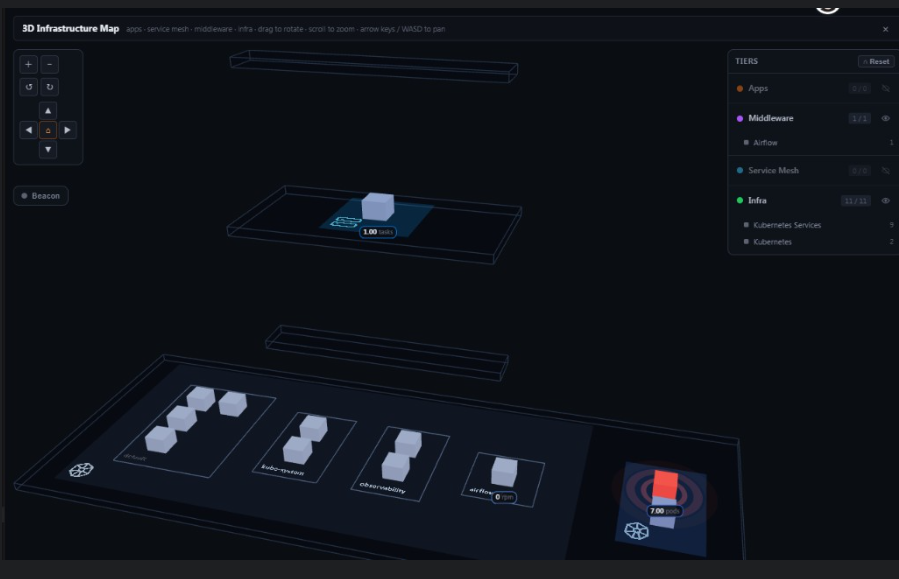
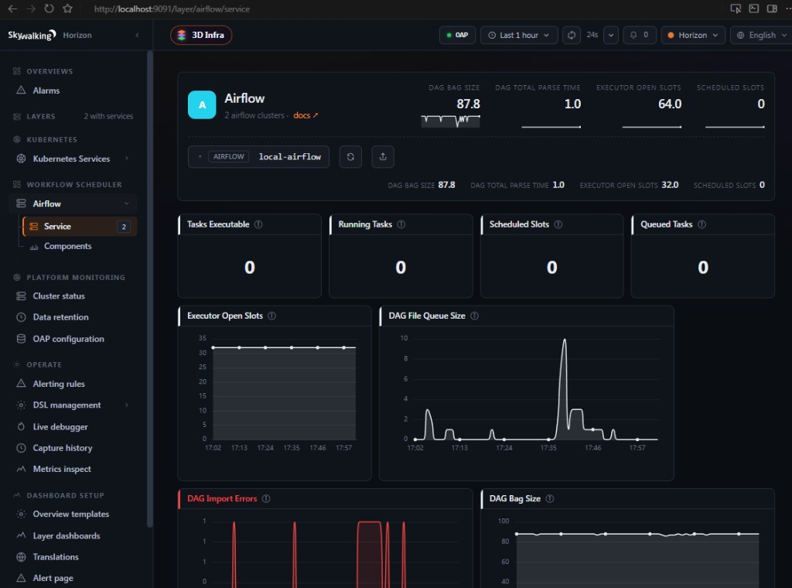
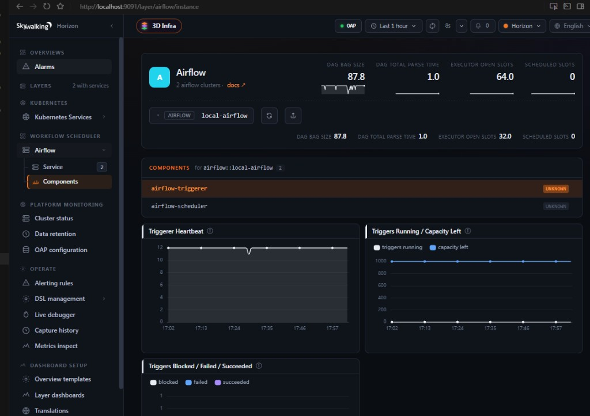
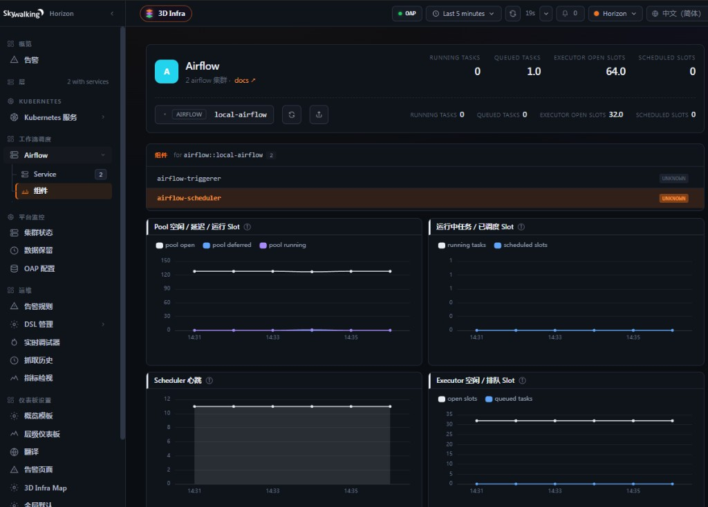
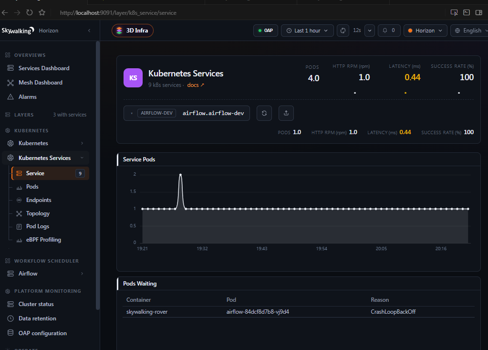
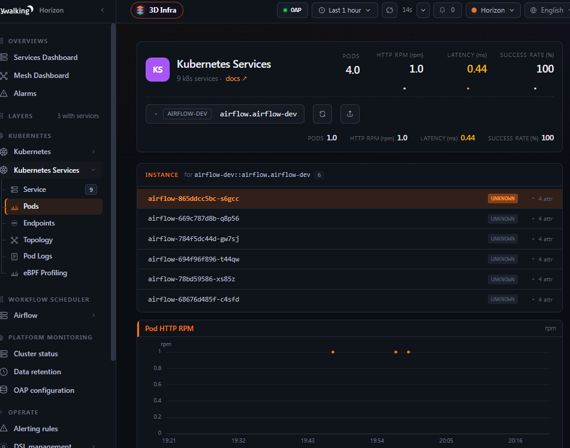
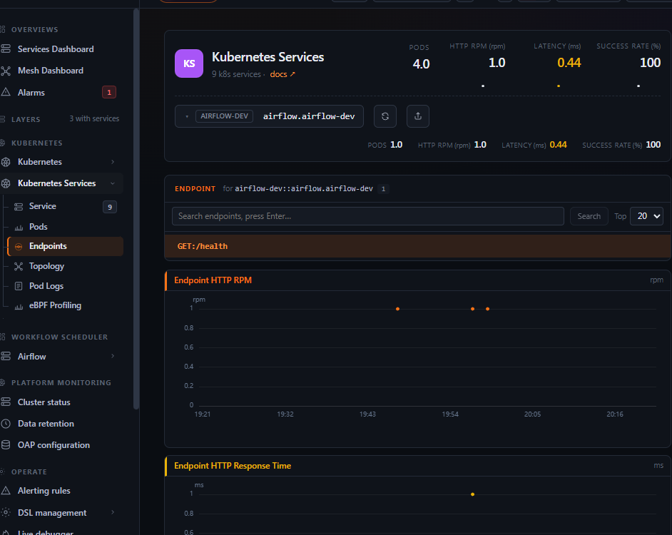
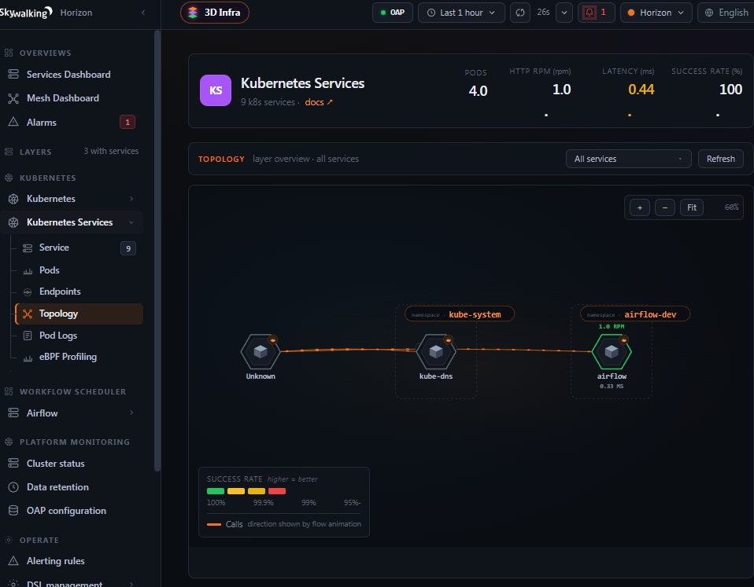

# Airflow monitoring

SkyWalking ingests **Apache Airflow 3.x** metrics from Airflow's native OpenTelemetry exporter via
the [OpenTelemetry receiver](opentelemetry-receiver.md), aggregates them with
[MAL](../../concepts-and-designs/mal.md), and shows them in Horizon UI under **Workflow Scheduler →
Airflow**.

## Data flow

1. Airflow exports metrics via native OpenTelemetry (`otel_on` / `OTEL_EXPORTER_OTLP_*`) from
   **scheduler** and **triggerer**.
2. OpenTelemetry Collector receives OTLP metrics and forwards them to SkyWalking OAP.
3. OAP aggregates metrics with [MAL](../../concepts-and-designs/mal.md).
4. Horizon UI displays them under **Workflow Scheduler → Airflow**.

## Setup

### 1. Enable Airflow OpenTelemetry metrics

Install the OTel extra and point export at your Collector. See
[Airflow metrics documentation](https://airflow.apache.org/docs/apache-airflow/stable/administration-and-deployment/logging-monitoring/metrics.html).

```bash
pip install 'apache-airflow[otel]'

export OTEL_EXPORTER_OTLP_ENDPOINT=http://otel-collector:4318
export OTEL_EXPORTER_OTLP_PROTOCOL=http/protobuf
export OTEL_RESOURCE_ATTRIBUTES=cluster=prod-airflow
```

Set `AIRFLOW__METRICS__OTEL_ON=True` on **scheduler** and **triggerer**.

Required OTLP resource attributes:

| Attribute | Purpose |
|-----------|---------|
| `cluster` | Names the Service (`airflow::{cluster}`) |
| `host.name` | Identifies scheduler or triggerer (UI **Components** tab) |

### 2. OpenTelemetry Collector

Forward OTLP metrics to OAP. Example pipeline:

```yaml
receivers:
  otlp:
    protocols:
      http:
        endpoint: 0.0.0.0:4318
      grpc:
        endpoint: 0.0.0.0:4317

processors:
  batch:

exporters:
  otlp:
    endpoint: oap:11800
    tls:
      insecure: true

service:
  pipelines:
    metrics:
      receivers: [otlp]
      processors: [batch]
      exporters: [otlp]
```

Full example: [`cluster/otel-collector-config.yaml`](../../../../test/e2e-v2/cases/airflow/cluster/otel-collector-config.yaml).
Do not hard-code service or instance names in Collector processors — derive them from Airflow's
resource attributes.

### 3. SkyWalking OAP

Ensure `airflow/*` is in `SW_OTEL_RECEIVER_ENABLED_OTEL_METRICS_RULES` (enabled by default).

## Entity model

| SkyWalking entity | Mapping |
|-------------------|---------|
| Service | `airflow::{cluster}` from resource `cluster` |
| Instance (OAP) / **Components** (UI) | Scheduler or triggerer from `host.name` |

### Components vs SkyWalking Instance vs Airflow Task Instance

OAP stores scheduler/triggerer hosts as **Instance**; Horizon UI labels the tab **Components** so
operators do not confuse it with an Airflow **Task Instance** (one task run inside a DAG run).

| Term | Meaning |
|------|---------|
| SkyWalking **Service** | One Airflow cluster (`airflow::{cluster}`) |
| **Components** (UI) / **Instance** (OAP) | Long-running scheduler or triggerer (`host.name`) |
| Airflow **Task Instance** | Single task execution — **not** on this dashboard |

Service panels aggregate cluster-wide samples. Component panels are scoped per `host.name`.

On Kubernetes, run a Collector **sidecar** per monitored pod; Airflow pushes to `localhost:4318` and
the sidecar forwards to OAP. Set `cluster` via `OTEL_RESOURCE_ATTRIBUTES`; `host.name` comes from
the pod hostname.

## Supported metrics

MAL rules: `otel-rules/airflow/airflow-service.yaml` and `airflow-instance.yaml`.
Asset counters use `airflow.asset.*` (Airflow 3.x only). Data source: Airflow native
OpenTelemetry export.

### Airflow Service Supported Metrics

| Monitoring Panel | Unit | Metric Name | Description |
|------------------|------|-------------|-------------|
| Tasks Executable | count | meter_airflow_scheduler_tasks_executable | Tasks ready for execution |
| Running Tasks | count | meter_airflow_executor_running_tasks | Tasks currently running on executor |
| Queued Tasks | count | meter_airflow_executor_queued_tasks | Queued tasks on executor |
| Scheduled Slots | count | meter_airflow_pool_scheduled_slots | Scheduled but not yet running slots in pool |
| Executor Open Slots | count | meter_airflow_executor_open_slots | Open executor slots |
| DAG File Queue Size | count | meter_airflow_dag_file_queue_size | DAG files pending scan |
| DAG Import Errors | count | meter_airflow_dag_import_errors | DAG files that failed to parse |
| DAG Bag Size | count | meter_airflow_dagbag_size | DAGs found in the last scheduler scan |
| DAG Total Parse Time | seconds | meter_airflow_dag_total_parse_time | Time to scan and import queued DAG files |
| DAG File Refresh Errors | count/min | meter_airflow_dag_file_refresh_error | DAG file load failures per minute |
| Asset Updates | count/min | meter_airflow_asset_updates | Updated assets per minute |

### Airflow Instance Supported Metrics

| Monitoring Panel | Unit | Metric Name | Description |
|------------------|------|-------------|-------------|
| Pool Open / Deferred / Running Slots | count | meter_airflow_instance_pool_open_slots, meter_airflow_instance_pool_deferred_slots, meter_airflow_instance_pool_running_slots | Pool capacity on the scheduler |
| Running Tasks / Scheduled Slots | count | meter_airflow_instance_executor_running_tasks, meter_airflow_instance_pool_scheduled_slots | Executor queue depth and pool slots waiting to run |
| Scheduler Heartbeat | count/min | meter_airflow_instance_scheduler_heartbeat | Scheduler heartbeats per minute |
| Executor Open / Queued Slots | count | meter_airflow_instance_executor_open_slots, meter_airflow_instance_executor_queued_tasks | Executor capacity and queue depth on the scheduler |
| Asset Updates | count/min | meter_airflow_instance_asset_updates | Asset updates on this host |
| Asset Triggered DagRuns | count/min | meter_airflow_instance_asset_triggered_dagruns | DagRuns triggered by assets |
| Triggerer Heartbeat | count/min | meter_airflow_instance_triggerer_heartbeat | Triggerer heartbeats per minute |
| Triggers Running / Capacity Left | count | meter_airflow_instance_triggers_running, meter_airflow_instance_triggerer_capacity_left | Live deferrable trigger load on the triggerer |
| Triggers Blocked / Failed / Succeeded | count/min | meter_airflow_instance_triggers_blocked_main_thread, meter_airflow_instance_triggers_failed, meter_airflow_instance_triggers_succeeded | Deferred trigger outcomes on the triggerer |

Panel-to-metric mapping details: [SWIP-7](../../swip/SWIP-7.md).

## Verification

Run the e2e suites (same as CI):

| Suite | Command | Checks |
|-------|---------|--------|
| Mock (full MAL contract) | `e2e run -c test/e2e-v2/cases/airflow/mock/e2e.yaml` | 29 |
| Cluster (native OTel smoke) | `e2e run -c test/e2e-v2/cases/airflow/cluster/e2e.yaml` | 16 |

CI runs both via [`.github/workflows/skywalking.yaml`](../../../../.github/workflows/skywalking.yaml)
(**Airflow** and **Airflow Cluster** matrix jobs) after `make docker.all`.

Details: [e2e README](../../../../test/e2e-v2/cases/airflow/README.md).

## Horizon UI

Open **Workflow Scheduler → Airflow** after OAP ingests metrics.

When Airflow is linked to `K8S_SERVICE` via [service hierarchy](../../concepts-and-designs/service-hierarchy.md),
start from the **3D Infrastructure Map** (middleware tier) and drill down into **Kubernetes Services**:



**Service** — cluster KPIs and DAG processing trends (11 panels).



**Components** — per-host scheduler (**six** widgets) or triggerer (**three** widgets); the
template defines nine widgets and each host shows only metrics present in OAP for that role.





**Kubernetes Services** — service, instances, endpoints, and topology for the linked `K8S_SERVICE`:









## Customization

Override MAL rules under `otel-rules/airflow/` or extend Horizon UI dashboards. Restart OAP after
rule changes.
