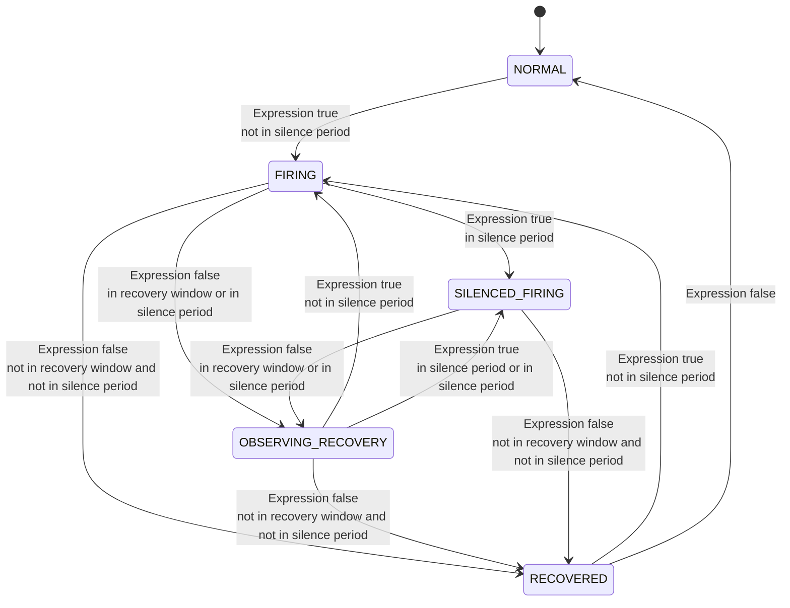

# Alerting
Alerting mechanism measures system performance according to the metrics of services/instances/endpoints from different layers.
Alerting kernel is an in-memory, time-window based queue.

The alerting core is driven by a collection of rules defined in `config/alarm-settings.yml.`
There are three parts to alerting rule definitions.
1. [alerting rules](#rules). They define how metrics alerting should be triggered and what conditions should be considered.
1. [hooks](#hooks). The list of hooks, which should be called after an alerting is triggered.

## Entity name
Defines the relation between scope and entity name.
- **Service**: Service name
- **Instance**: {Instance name} of {Service name}
- **Endpoint**: {Endpoint name} in {Service name}
- **Service Relation**: {Source service name} to {Dest service name}
- **Instance Relation**: {Source instance name} of {Source service name} to {Dest instance name} of {Dest service name}
- **Endpoint Relation**: {Source endpoint name} in {Source Service name} to {Dest endpoint name} in {Dest service name}

## Rules
An alerting rule is made up of the following elements:
- **Rule id**. A unique name shown in the alarm message. It must end with `_rule`.
- **Expression**. A [MQE](../../api/metrics-query-expression.md) expression that defines the conditions of the rule.
The result type must be `SINGLE_VALUE` and the root operation of the expression must be a 
[Compare Operation](../../api/metrics-query-expression.md#compare-operation) or [Bool Operation](../../api/metrics-query-expression.md#bool-operation) which provides `1`(true) or `0`(false) result.
When the result is `1`(true), the alarm will be triggered.
For example, `avg(service_resp_time / 1000) > 1` is a valid expression to indicate the request latency is slower than 1s. The typical illegal expressions are
    - `avg(service_resp_time > 1000) + 1` expression root doesn't use `Compare Operation`
    - `service_resp_time > 1000` expression return a `TIME_SERIES_VALUES` type of values rather than a `SINGLE_VALUE` value.

The metrics names in the expression could be found in the [list of all potential metrics name](#list-of-all-potential-metrics-name) doc.
- **Include names**. Entity names that are included in this rule. Please follow the [entity name definitions](#entity-name).
- **Exclude names**. Entity names that are excluded from this rule. Please follow the [entity name definitions](#entity-name).
- **Include names regex**. A regex that includes entity names. If both include-name list and include-name regex are set, both rules will take effect.
- **Exclude names regex**. A regex that excludes entity names. Both rules will take effect if both include-label list and include-label regex are set.
- **Tags**. Tags are key/value pairs that are attached to alarms. Tags are used to specify distinguishing attributes of alarms that are meaningful and relevant to users. If you want to make these tags searchable on the SkyWalking UI, you may set the tag keys in `core/default/searchableAlarmTags` or through the system environment variable `SW_SEARCHABLE_ALARM_TAG_KEYS`. The key `level` is supported by default.
- **Period**. The size of metrics cache in minutes for checking the alarm conditions. This is a time window that corresponds to the backend deployment env time.
- **Hooks**. Binding the specific ids of the hooks when the alarm is triggered.
  The id format is `{hookType}.{hookName}` (slack.custom1 e.g.) and must be defined in the `hooks` section of the `alarm-settings.yml` file.
  If the hook id is not specified, the global hook will be used.
- **Silence period**. After the alarm is triggered at Time-N (TN), there will be silence during the **TN -> TN + period**.
By default, it works in the same manner as **period**. The same Alarm (having the same ID in the same metrics name) may only be triggered once within a period. 
- **Recovery observation period**. Defines the number of consecutive periods that the alarm condition must remain false before the alarm is considered recovered. When the alarm condition becomes false, the system enters an observation period. If the condition remains false for the specified number of periods, a recovery notification is sent. If the condition becomes true again during the observation period, the alarm returns to the FIRING state. 
The default value is 0, which means immediate recovery notification when the condition becomes false. 
**Notice:** because the alarm will not be triggered again during the silence period, recovery won't be triggered during the silence period after an alarm is fired. It will be in the OBSERVING_RECOVERY state, the recovery will be triggered only after the silence period is over and the condition remains false for the specified observation periods.


Such as for a metric, there is a shifting window as following at T7.

| T1     | T2     | T3     | T4     | T5     | T6     | T7     |
|--------|--------|--------|--------|--------|--------|--------|
| Value1 | Value2 | Value3 | Value4 | Value5 | Value6 | Value7 |

* `Period`(Time point T1 ~ T7) are continuous data points for minutes. Notice, alerts are not supported above minute-by-minute periods as they would not be efficient.
* Values(Value1 ~ Value7) are the values or labeled values for every time point.
* `Expression` is calculated based on the metric values(Value1 ~ Value7). 
For example, expression `avg(service_resp_time) > 1000`, if the value are `1001, 1001, 1001, 1001, 1001, 1001, 1001`, 
the calculation is `((1001 + 10001 + ... + 1001) / 7) > 1000` and the result would be `1`(true). Then the alarm would be triggered.
* In every minute, the window would shift automatically. At T8, Value8 would be cached, and T1/Value1 would be removed from the window.
* If Value8 is 890, the expression will be calculated based on the metric values from T2 to T8, which are `1001, 1001, 1001, 1001, 1001, 1001, 990`. The calculation becomes `((1001 + 1001 + ... + 890) / 7) < 1000`, and the result would be `0`(false). Consequently, the alarm enters an observation period for recovery. If the `Recovery observation period`is not set or is set to `0`, the alarm is considered recovered immediately, and a recovery notification is sent. Otherwise, the system will wait and observe the condition over the specified number of subsequent periods before declaring recovery.

**NOTE**: 
* If the expression include labeled metrics and result has multiple labeled value(e.g. `sum(service_percentile{p='50,75'} > 1000) >= 3`), the alarm will be triggered if any of the labeled value result matches 3 times of the condition(P50 > 1000 or P75 > 1000).
* One alarm rule is targeting the same entity level, such as service-level expression (`avg(service_resp_time) > 1000`).
  Set entity names(Include/Exclude names...) according to metrics entity levels,
  do not include different entity levels metrics in the same expression, such as service metrics and endpoint metrics.

```yaml
rules:
  # Rule unique id, must be ended with `_rule`.
  endpoint_percent_rule:
    # A MQE expression and the root operation of the expression must be a Compare Operation.
    expression: sum((endpoint_sla / 100) < 75) >= 3
    # The length of time to evaluate the metrics
    period: 10
    # How many times of checks, the alarm keeps silence after alarm triggered, default as same as period.
    silence-period: 10
    # Number of periods to wait before considering the alarm recovered,default as 0.
    recovery-observation-period: 2
    message: Successful rate of endpoint {name} is lower than 75%
    tags:
      level: WARNING
  service_percent_rule:
    expression: sum((service_sla / 100) < 85) >= 4
    # [Optional] Default, match all services in this metrics
    include-names:
      - service_a
      - service_b
    exclude-names:
      - service_c
    period: 10
    message: Service {name} successful rate is less than 85%
  service_resp_time_percentile_rule:
    expression: sum(service_percentile{p='50,75,90,95,99'} > 1000) >= 3
    period: 10
    silence-period: 5
    message: Percentile response time of service {name} alarm in 3 minutes of last 10 minutes, due to more than one condition of p50 > 1000, p75 > 1000, p90 > 1000, p95 > 1000, p99 > 1000
  meter_service_status_code_rule:
    expression: sum(aggregate_labels(meter_status_code{status='4xx,5xx'},sum) > 10) > 3
    period: 10
    silence-period: 5
    message: The request number of entity {name} 4xx and 5xx status is more than expected.
    hooks:
      - "slack.custom1"
      - "pagerduty.custom1"
  comp_rule:
    expression: (avg(service_sla / 100) > 80) && (avg(service_percentile{p='0'}) > 1000)
    period: 10
    message: Service {name} avg successful rate is less than 80% and P50 of avg response time is over 1000ms in last 10 minutes.
    tags:
      level: CRITICAL
    hooks:
      - "slack.default"
      - "slack.custom1"
      - "pagerduty.custom1"
```


### Default alarm rules
For convenience's sake, we have provided a default `alarm-setting.yml` in our release. It includes the following rules:
1. Service average response time over 1s in the last 3 minutes.
1. Service success rate lower than 80% in the last 2 minutes.
1. Percentile of service response time over 1s in the last 3 minutes
1. Service Instance average response time over 1s in the last 2 minutes, and the instance name matches the regex.
1. Endpoint average response time over 1s in the last 2 minutes.
1. Database access average response time over 1s in the last 2 minutes.
1. Endpoint relation average response time over 1s in the last 2 minutes.

### List of all potential metrics name
The metrics names are defined in the official [OAL scripts](../../guides/backend-oal-scripts.md) and [MAL scripts](../../concepts-and-designs/mal.md).

Currently, metrics from the **Service**, **Service Instance**, **Endpoint**, **Service Relation**, **Service Instance Relation**, **Endpoint Relation** scopes could be used in Alarm, and the **Database access** scope is the same as **Service**.

Submit an issue or a pull request if you want to support any other scopes in Alarm.

### Use the Baseline Predicted Value to trigger the Alarm
Since 10.2.0, SkyWalking supports using the baseline predicted value in the alarm rule expression. 
The MQE expression can refer to [Baseline Operation](../../api/metrics-query-expression.md#baseline-operation).

For example, the following rule will compare the service response time with the baseline predicted value in each time bucket, and
when the service response time is higher than the baseline predicted value in 3 minutes of the last 10 minutes, the alarm will be triggered.

```yaml
rules:
  service_resp_time_rule:
    expression: sum(service_resp_time > baseline(service_resp_time, upper)) > 3
    period: 10
    message: Service {name} response time is higher than the baseline predicted value in 3 minutes of last 10 minutes.
```

Note, the baseline predicted value is calculated based on the historical data of the same time window in the past, which
is through [AI powered baseline calculation](../ai-pipeline/metrics-baseline-integration.md).

## Hooks
Hooks are a way to send alarm messages to the outside world. SkyWalking supports multiple hooks of the same type, each hook can support different configurations. 
For example, you can configure two Slack hooks, one id is `default` and set `is-default: true` means this hook will apply on all `Alarm Rules` **without config** `hooks`.
Another id is `custom1` will only apply on the `Alarm Rules` which **with config** `hooks` and include the id `slack.custom1`.

```yaml
hooks:
  slack:
    # default here is just a name, set the field 'is-default: true' if this notification hook is expected to be default globally.
    default:
      # If true, this hook will apply on all rules, unless a rule has its own specific hook. Could have more than one default hooks in the same hook type.
      is-default: true 
      text-template: |-
        {
          "type": "section",
          "text": {
            "type": "mrkdwn",
            "text": ":alarm_clock: *Apache Skywalking Alarm* \n **%s**."
          }
        }
      recovery-text-template: |-
        {
          "type": "section",
          "text": {
            "type": "mrkdwn",
            "text": ":green_heart: *Apache SkyWalking Alarm Recovered*  \n **%s**."
          }
        }  
      webhooks:
        - https://hooks.slack.com/services/x/y/zssss
    custom1:
      text-template: |-
        {
          "type": "section",
          "text": {
            "type": "mrkdwn",
            "text": ":alarm_clock: *Apache Skywalking Alarm* \n **%s**."
          }
        }
      webhooks:
        - https://hooks.slack.com/services/x/y/custom1
```

Currently, SkyWalking supports the following hook types:

### Webhook
The Webhook requires the peer to be a web container. The alarm message will be sent through HTTP post by `application/json` content type after you have set up Webhook hooks as follows: 
```yml
webhook:
  default:
    is-default: true
    urls:
      - http://ip:port/xxx
      - http://ip:port/yyy
    custom1:
      urls:
        - http://127.0.0.1/custom1
      recovery-urls:
        - http://127.0.0.1/custom1
      # headers config is provided to add custom configurations or authentications that are required from the server side.
      headers:
        Authorization: Bearer bearer_token
    custom2:
      urls:
        - http://127.0.0.1/custom2
      recovery-urls:
        - http://127.0.0.1/custom2
      # headers config is provided to add custom configurations or authentications that are required from the server 
      headers:
        Authorization: Basic basic_token
    custom3:
      urls:
        - http://127.0.0.1/internal-hook
      # headers config is provided to add custom configurations or authentications that are required from the server 
      headers:
        x-company-token: whatever-token-defined-internally-within-the-company
        x-company-header: arbitrary-additional-http-headers
```

The JSON format is based on `List<org.apache.skywalking.oap.server.core.alarm.AlarmMessage>` with the following key information:
- **scopeId**, **scope**. All scopes are defined in `org.apache.skywalking.oap.server.core.source.DefaultScopeDefine`.
- **name**. Target scope entity name. Please follow the [entity name definitions](#entity-name).
- **uuid** : The unique identifier (UUID) of the alarm, which is consistent between the trigger and recovery messages.
- **id0**. The ID of the scope entity that matches with the name. When using the relation scope, it is the source entity ID.
- **id1**. When using the relation scope, it is the destination entity ID. Otherwise, it is empty.
- **ruleName**. The rule name configured in `alarm-settings.yml`.
- **alarmMessage**. The alarm text message.
- **startTime**. The time, in milliseconds since the Unix epoch (January 1, 1970 UTC), when the alarm was triggered.
- **recoveryTime**. The time, in milliseconds since the Unix epoch (January 1, 1970 UTC), when the alarm was recovered. This value is `null` if the alarm has not been recovered.
- **tags**. The tags configured in `alarm-settings.yml`.

See the following example:
```json
[{
  "scopeId": 1, 
  "scope": "SERVICE",
  "name": "serviceA", 
  "uuid": "uuid1",
  "id0": "12",  
  "id1": "",  
  "ruleName": "service_resp_time_rule",
  "alarmMessage": "alarmMessage xxxx",
  "startTime": 1560524171000,
  "recoveryTime": 1560524351000,
  "tags": [{
        "key": "level",
        "value": "WARNING"
     }]
}, {
  "scopeId": 1,
  "scope": "SERVICE",
  "name": "serviceB",
  "uuid": "uuid2", 
  "id0": "23",
  "id1": "",
  "ruleName": "service_resp_time_rule",
  "alarmMessage": "alarmMessage yyy",
  "startTime": 1560524171000,
    "tags": [{
        "key": "level",
        "value": "CRITICAL"
    }]
}]
```

### gRPC
The alarm message will be sent through remote gRPC method by `Protobuf` content type after you have set up gRPC hooks as follows:
```yml
gRPC:
  default:
    is-default: true
    target-host: ip
    target-port: port
```

The message contains key information which are defined in `oap-server/server-alarm-plugin/src/main/proto/alarm-hook.proto`.

Part of the protocol looks like this:
```protobuf
message AlarmMessage {
    int64 scopeId = 1;
    string scope = 2;
    string name = 3;
    string id0 = 4;
    string id1 = 5;
    string ruleName = 6;
    string alarmMessage = 7;
    int64 startTime = 8;
    AlarmTags tags = 9;
    string uuid = 10;
}

message AlarmRecoveryMessage {
    int64 scopeId = 1;
    string scope = 2;
    string name = 3;
    string id0 = 4;
    string id1 = 5;
    string ruleName = 6;
    string alarmMessage = 7;
    int64 startTime = 8;
    AlarmTags tags = 9;
    string uuid = 10;
    int64 recoveryTime = 11;
}

message AlarmTags {
    // String key, String value pair.
    repeated KeyStringValuePair data = 1;
}

message KeyStringValuePair {
    string key = 1;
    string value = 2;
}
```

### Slack Chat
Follow the [Getting Started with Incoming Webhooks guide](https://api.slack.com/messaging/webhooks) and create new Webhooks.

The alarm message will be sent through HTTP post by `application/json` content type if you have configured Slack Incoming Webhooks as follows:
```yml
slack:
  default:
    is-default: true
    text-template: |-
      {
        "type": "section",
        "text": {
          "type": "mrkdwn",
          "text": ":alarm_clock: *Apache Skywalking Alarm* \n **%s**."
        }
      }
     recovery-text-template: |-
      {
        "type": "section",
        "text": {
          "type": "mrkdwn",
          "text": ":green_heart: *Apache SkyWalking Alarm Recovered* \n **%s**."
        }
      } 
    webhooks:
    - https://hooks.slack.com/services/x/y/z
```

### WeChat
Note that only the WeChat Company Edition (WeCom) supports WebHooks. To use the WeChat WebHook, follow the [Wechat Webhooks guide](https://open.work.weixin.qq.com/help2/pc/14931).
The alarm message will be sent through HTTP post by `application/json` content type after you have set up Wechat Webhooks as follows:
```yml
wechat:
  default:
    is-default: true
    text-template: |-
      {
        "msgtype": "text",
        "text": {
          "content": "Apache SkyWalking Alarm: \n %s."
        }
      }
    recovery-text-template: |-
      {
        "msgtype": "text",
        "text": {
          "content": "Apache SkyWalking Alarm Recovered: \n %s."
        }
      }
    webhooks:
    - https://qyapi.weixin.qq.com/cgi-bin/webhook/send?key=dummy_key
```

### DingTalk
Follow the [Dingtalk Webhooks guide](https://ding-doc.dingtalk.com/doc#/serverapi2/qf2nxq/uKPlK) and create new Webhooks.
You can configure an optional secret for an individual webhook URL for security purposes.
The alarm message will be sent through HTTP post by `application/json` content type if you have configured DingTalk Webhooks as follows:
```yml
dingtalk:
  default:
    is-default: true
    text-template: |-
      {
        "msgtype": "text",
        "text": {
          "content": "Apache SkyWalking Alarm: \n %s."
        }
      }
    recovery-text-template: |-
      {
        "msgtype": "text",
        "text": {
          "content": "Apache SkyWalking Alarm Recovered: \n %s."
        }
      }
    webhooks:
    - url: https://oapi.dingtalk.com/robot/send?access_token=dummy_token
      secret: dummysecret
```

### Feishu
Follow the [Feishu Webhooks guide](https://www.feishu.cn/hc/zh-cn/articles/360024984973) and create new Webhooks.
You can configure an optional secret for an individual webhook URL for security purposes.
If you want to direct a text to a user, you can configure `ats`, which is Feishu's user_id and separated by "," .
The alarm message will be sent through HTTP post by `application/json` content type if you have configured Feishu Webhooks as follows:
```yml
feishu:
  default:
    is-default: true
    text-template: |-
      {
        "msg_type": "text",
        "content": {
          "text": "Apache SkyWalking Alarm: \n %s."
        },
        "ats":"feishu_user_id_1,feishu_user_id_2"
      }
    recovery-text-template: |-
      {
        "msg_type": "text",
        "content": {
          "text": "Apache SkyWalking Alarm Recovered: \n %s."
        },
         "ats":"feishu_user_id_1,feishu_user_id_2"
      }
    webhooks:
    - url: https://open.feishu.cn/open-apis/bot/v2/hook/dummy_token
      secret: dummysecret
```

### WeLink
Follow the [WeLink Webhooks guide](https://open.welink.huaweicloud.com/apiexplorer/#/apiexplorer?type=internal&method=POST&path=/welinkim/v1/im-service/chat/group-chat) and create new Webhooks.
The alarm message will be sent through HTTP post by `application/json` content type if you have configured WeLink Webhooks as follows:
```yml
welink:
  default:
    is-default: true
    text-template: "Apache SkyWalking Alarm: \n %s."
    recovery-text-template: "Apache SkyWalking Alarm Recovered: \n %s."
    webhooks:
    # you may find your own client_id and client_secret in your app, below are dummy, need to change.
    - client-id: "dummy_client_id"
      client-secret: dummy_secret_key
      access-token-url: https://open.welink.huaweicloud.com/api/auth/v2/tickets
      message-url: https://open.welink.huaweicloud.com/api/welinkim/v1/im-service/chat/group-chat
      # if you send to multi group at a time, separate group_ids with commas, e.g. "123xx","456xx"
      group-ids: "dummy_group_id"
      # make a name you like for the robot, it will display in group
      robot-name: robot
```


### PagerDuty
The PagerDuty hook is based on [Events API v2](https://developer.pagerduty.com/docs/ZG9jOjExMDI5NTgw-events-api-v2-overview).

Follow the [Getting Started](https://developer.pagerduty.com/docs/ZG9jOjExMDI5NTgw-events-api-v2-overview#getting-started) section to create an **Events API v2** integration on your PagerDuty service and copy the integration key.

Then configure as follows:
```yml
pagerduty:
  default:
    is-default: true
    text-template: "Apache SkyWalking Alarm: \n %s."
    recovery-text-template: "Apache SkyWalking Alarm Recovered: \n %s."
    integration-keys:
    - 5c6d805c9dcf4e03d09dfa81e8789ba1
```

You can also configure multiple integration keys.

### Discord
Follow the [Discord Webhooks guide](https://support.discord.com/hc/en-us/articles/228383668-Intro-to-Webhooks) and create a new webhook.

Then configure as follows:
```yml
discord:
  default:
    is-default: true
    text-template: "Apache SkyWalking Alarm: \n %s."
    recovery-text-template: "Apache SkyWalking Alarm Recovered: \n %s."
    webhooks:
    - url: https://discordapp.com/api/webhooks/1008166889777414645/8e0Am4Zb-YGbBqqbiiq0jSHPTEEaHa4j1vIC-zSSm231T8ewGxgY0_XUYpY-k1nN4HBl
      username: robot
```

## Update the settings dynamically
Since 6.5.0, the alerting settings can be updated dynamically at runtime by [Dynamic Configuration](dynamic-config.md),
which will override the settings in `alarm-settings.yml`.

In order to determine whether an alerting rule is triggered or not, SkyWalking needs to cache the metrics of a time window for
each alerting rule. If any attribute (`expression`, `period`, etc.) of a rule is changed,
the sliding window will be destroyed and re-created, causing the Alarm of this specific rule to restart again.

### Keys with data types of alerting rule configuration file

| Alerting element            | Configuration property key  | Type           | Description        |
| --------------------------- | --------------------------- | -------------- | ------------------ |
| Expression                  | expression                  | string         | MQE expression     |
| Include names               | include-names               | string array   |                    |
| Exclude names               | exclude-names               | string array   |                    |
| Include names regex         | include-names-regex         | string         | Java regex Pattern |
| Exclude names regex         | exclude-names-regex         | string         | Java regex Pattern |
| Tags                        | tags                        | key-value pair |                    |
| Period                      | period                      | int            |                    |
| Silence period              | silence-period              | int            |                    |
| Recovery observation period | recovery-observation-period | int            |                    |
| Message                     | message                     | string         |                    |
| Hooks                       | hooks                       | string array   |                    |

## Alarm state transition
The overall alarm state transition after the introduction of alarm restoration detection and notification since version 10.4.0 is as follows:

