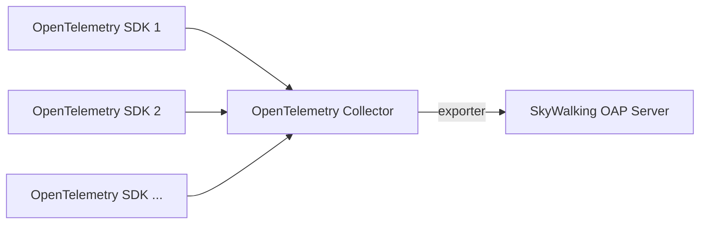

# OpenTelemetry Logging Format

SkyWalking can receive logs exported from OpenTelemetry collector, the data flow is:



where the `exporter` can be one of the following:

- [OpenTelemetry SkyWalking Exporter](https://github.com/open-telemetry/opentelemetry-collector-contrib/tree/5133f4ccd69fa40d016c5b7f2198fb6ac61007b4/exporter/skywalkingexporter).
  An exporter that transforms the logs to SkyWalking format before sending them to SkyWalking OAP. Read the doc in the
  aforementioned link for a detailed guide.
- [OpenTelemetry OTLP Exporter](#opentelemetry-otlp-exporter). An exporter that sends the logs to SkyWalking OAP in OTLP
  format, and SkyWalking OAP is responsible for transforming the data format.

## OpenTelemetry OTLP Exporter

By using this exporter, you can send any log data to SkyWalking OAP as long as the data is in OTLP format, no matter
where the data is generated.

To enable this exporter, make sure the `receiver-otel` is enabled and the `otlp-logs` value is in
the `receiver-otel/default/enabledHandlers` configuration section:

```yaml
receiver-otel:
  selector: ${SW_OTEL_RECEIVER:default}
  default:
    enabledHandlers: ${SW_OTEL_RECEIVER_ENABLED_HANDLERS:"otlp-metrics,otlp-logs"}
```

Also, because most of the language SDKs of OpenTelemetry do not support logging feature (yet) or the logging feature is
experimental, it's your responsibility to make sure the reported log data contains the following attributes, otherwise
SkyWalking is not able to consume them:

- `service.name`: the name of the service that generates the log data, OpenTelemetry Java SDK (experimental) has this
  attribute set, if you're using other SDK or agent, please check the corresponding doc.
