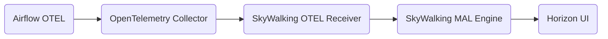

# Support Apache Airflow Monitoring

## Motivation

Apache Airflow is an open-source workflow management platform primarily used for scheduling and
monitoring workflows. It can be used to handle complex data pipelines and has been widely applied
in the fields of data engineering and data science. Airflow allows users to write workflows called
DAGs (Directed Acyclic Graphs). Each DAG contains a series of tasks that can be executed in a
specific sequence and dependency relationship. Due to its support for multitasking in complex
scenarios, monitoring the health and operational status of Airflow is crucial. Through these
metrics, it is possible to help analyze task health status, formulate optimization plans, and
design risk prevention strategies.

## Architecture Graph

There is no significant architecture-level change.

## Proposed Changes

1. Airflow exports metrics via native OpenTelemetry (`otel_on` / `OTEL_EXPORTER_OTLP_*`).
2. OpenTelemetry Collector receives OTLP metrics from Airflow and forwards them to SkyWalking
   OTel Receiver via the OpenTelemetry exporter.
3. The SkyWalking OAP Server parses expressions with [MAL](../concepts-and-designs/mal.md) to
   filter, calculate, aggregate, and store the results.
4. Metrics are displayed via [Horizon UI](https://github.com/apache/skywalking-horizon-ui) under the
   **Workflow Scheduler** menu group and can be customized on dashboards.

SkyWalking models an Airflow deployment as `Layer: AIRFLOW`:

- **Service** — one logical cluster (`airflow::{cluster}`), keyed by resource attribute `cluster`.
- **Instance** — scheduler / worker / triggerer host (`host.name` resource attribute).

Horizon labels this entity **Components** rather than **Instance** so operators are not led to
confuse it with Airflow **Task Instance** (a single task execution within one DAG run). See
[Airflow monitoring setup](../setup/backend/backend-airflow-monitoring.md#components-vs-skywalking-instance-vs-airflow-task-instance)
for the full naming rationale.

### Airflow Service Supported Metrics

| Monitoring Panel | Unit | Metric Name | Description |
|------------------|------|-------------|-------------|
| Tasks Executable | count | meter_airflow_scheduler_tasks_executable | Tasks ready for execution |
| Queued Tasks | count | meter_airflow_executor_queued_tasks | Queued tasks on executor |
| Running Tasks | count | meter_airflow_executor_running_tasks | Tasks currently running on executor |
| Open Slots | count | meter_airflow_executor_open_slots | Open executor slots |
| Pool Queued Slots | count | meter_airflow_pool_queued_slots | Queued slots in pool |
| Pool Deferred Slots | count | meter_airflow_pool_deferred_slots | Deferred slots in pool |
| Pool Scheduled Slots | count | meter_airflow_pool_scheduled_slots | Scheduled but not yet running slots in pool |
| Scheduler Heartbeat | count | meter_airflow_scheduler_heartbeat | Scheduler heartbeats per minute |
| Orphaned Tasks Cleared | count | meter_airflow_scheduler_orphaned_tasks_cleared | Orphaned tasks cleared per minute |
| Orphaned Tasks Adopted | count | meter_airflow_scheduler_orphaned_tasks_adopted | Orphaned tasks adopted per minute |
| DAG File Queue Size | count | meter_airflow_dag_file_queue_size | DAG files pending scan |
| Asset Updates | count | meter_airflow_asset_updates | Updated assets per minute |

### Airflow Instance Supported Metrics

| Monitoring Panel | Unit | Metric Name | Description |
|------------------|------|-------------|-------------|
| Pool Open Slots | count | meter_airflow_instance_pool_open_slots | Open slots in pool on this host |
| Pool Deferred Slots | count | meter_airflow_instance_pool_deferred_slots | Deferred slots in pool on this host |
| Pool Running Slots | count | meter_airflow_instance_pool_running_slots | Running slots in pool on this host |
| Pool Scheduled Slots | count | meter_airflow_instance_pool_scheduled_slots | Scheduled but not yet running slots on this host |
| Triggerer Heartbeat | count | meter_airflow_instance_triggerer_heartbeat | Triggerer heartbeats per minute |
| Triggers Blocked Main Thread | count | meter_airflow_instance_triggers_blocked_main_thread | Triggers blocking main thread |
| Triggers Failed | count | meter_airflow_instance_triggers_failed | Triggers that failed before firing |
| Triggers Succeeded | count | meter_airflow_instance_triggers_succeeded | Triggers that fired at least once |
| Tasks Executable | count | meter_airflow_instance_scheduler_tasks_executable | Tasks ready on this host |
| Orphaned Tasks Cleared | count | meter_airflow_instance_scheduler_orphaned_tasks_cleared | Orphaned tasks cleared on this host per minute |
| Orphaned Tasks Adopted | count | meter_airflow_instance_scheduler_orphaned_tasks_adopted | Orphaned tasks adopted on this host per minute |
| Queued Tasks | count | meter_airflow_instance_executor_queued_tasks | Queued tasks on this host |
| Running Tasks | count | meter_airflow_instance_executor_running_tasks | Running tasks on this host |
| Asset Updates | count | meter_airflow_instance_asset_updates | Asset updates on this host |
| Asset Orphaned | count | meter_airflow_instance_asset_orphaned | Orphaned assets on this host |
| Asset Triggered DagRuns | count | meter_airflow_instance_asset_triggered_dagruns | DagRuns triggered by assets |

Service-level panels aggregate cluster-wide samples. Instance-level panels are scoped per
`host.name` (shown as **Components** in the UI). Do not sum instance-scoped samples into service dashboards when each component
exports the same instrument independently.

Bundled Horizon UI dashboards chart the primary panels above; additional OAP metrics (for example
orphaned-task counters) are available via MQE even when not shown on a default widget.

## Imported Dependencies libs and their licenses.

No new dependency.

## Compatibility

No breaking changes.

## General usage docs

See [Airflow monitoring setup](../setup/backend/backend-airflow-monitoring.md) and
[e2e coverage matrix](../../../test/e2e-v2/cases/airflow/README.md).
