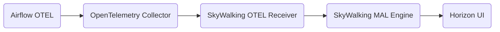

# Support Apache Airflow Monitoring

## Motivation

Apache Airflow is an open-source workflow management platform primarily used for scheduling and
monitoring workflows. It can be used to handle complex data pipelines and has been widely applied
in the fields of data engineering and data science. Airflow allows users to write workflows called
DAGs (Directed Acyclic Graphs). Each DAG contains a series of tasks that can be executed in a
specific sequence and dependency relationship. Due to its support for multitasking in complex
scenarios, monitoring the health and operational status of Airflow is crucial. Through these
metrics, it is possible to help analyze task health status, formulate optimization plans, and
design risk prevention strategies.

## Architecture Graph

## Proposed Changes

1. Airflow exports metrics via native OpenTelemetry (`otel_on` / `OTEL_EXPORTER_OTLP_*`).
2. OpenTelemetry Collector receives OTLP metrics from Airflow and forwards them to SkyWalking
   OTel Receiver via the OpenTelemetry exporter.
3. The SkyWalking OAP Server parses expressions with [MAL](../concepts-and-designs/mal.md) to
   filter, calculate, aggregate, and store the results.
4. Metrics are displayed via [Horizon UI](https://github.com/apache/skywalking-horizon-ui) under the
   **Workflow Scheduler** menu group and can be customized on dashboards.

SkyWalking models an Airflow deployment as `Layer: AIRFLOW`:

- **Service** — one logical cluster (`airflow::{cluster}`), keyed by resource attribute `cluster`.
- **Instance** — scheduler or triggerer host (`host.name` resource attribute).

Horizon labels this entity **Components** rather than **Instance** so operators are not led to
confuse it with Airflow **Task Instance** (a single task execution within one DAG run). See
[Airflow monitoring setup](../setup/backend/backend-airflow-monitoring.md#components-vs-skywalking-instance-vs-airflow-task-instance)
for the full naming rationale.

### Airflow Service Supported Metrics

| Monitoring Panel | Unit | Metric Name | Description |
|------------------|------|-------------|-------------|
| Tasks Executable | count | meter_airflow_scheduler_tasks_executable | Tasks ready for execution |
| Running Tasks | count | meter_airflow_executor_running_tasks | Tasks currently running on executor |
| Queued Tasks | count | meter_airflow_executor_queued_tasks | Queued tasks on executor |
| Scheduled Slots | count | meter_airflow_pool_scheduled_slots | Scheduled but not yet running slots in pool (aggregated across pools via `aggregate_labels` in the UI KPI card) |
| Executor Open Slots | count | meter_airflow_executor_open_slots | Open executor slots |
| DAG File Queue Size | count | meter_airflow_dag_file_queue_size | DAG files pending scan |
| DAG Import Errors | count | meter_airflow_dag_import_errors | DAG files that failed to parse |
| DAG Bag Size | count | meter_airflow_dagbag_size | DAGs found in the last scheduler scan |
| DAG Total Parse Time | seconds | meter_airflow_dag_total_parse_time | Time to scan and import queued DAG files |
| DAG File Refresh Errors | count/min | meter_airflow_dag_file_refresh_error | DAG file load failures per minute |
| Asset Updates | count/min | meter_airflow_asset_updates | Updated assets per minute |

### Airflow Instance Supported Metrics

| Monitoring Panel | Unit | Metric Name | Description |
|------------------|------|-------------|-------------|
| Pool Open / Deferred / Running Slots | count | meter_airflow_instance_pool_open_slots, meter_airflow_instance_pool_deferred_slots, meter_airflow_instance_pool_running_slots | Pool capacity on the scheduler |
| Running Tasks / Scheduled Slots | count | meter_airflow_instance_executor_running_tasks, meter_airflow_instance_pool_scheduled_slots | Executor queue depth and pool slots waiting to run |
| Scheduler Heartbeat | count/min | meter_airflow_instance_scheduler_heartbeat | Scheduler heartbeats per minute |
| Executor Open / Queued Slots | count | meter_airflow_instance_executor_open_slots, meter_airflow_instance_executor_queued_tasks | Executor capacity and queue depth on the scheduler |
| Asset Updates | count/min | meter_airflow_instance_asset_updates | Asset updates on this host |
| Asset Triggered DagRuns | count/min | meter_airflow_instance_asset_triggered_dagruns | DagRuns triggered by assets |
| Triggerer Heartbeat | count/min | meter_airflow_instance_triggerer_heartbeat | Triggerer heartbeats per minute |
| Triggers Running / Capacity Left | count | meter_airflow_instance_triggers_running, meter_airflow_instance_triggerer_capacity_left | Live deferrable trigger load on the triggerer |
| Triggers Blocked / Failed / Succeeded | count/min | meter_airflow_instance_triggers_blocked_main_thread, meter_airflow_instance_triggers_failed, meter_airflow_instance_triggers_succeeded | Deferred trigger outcomes on the triggerer |

Service-level panels aggregate cluster-wide samples. Instance-level panels are scoped per
`host.name` (shown as **Components** in the UI). Do not sum instance-scoped samples into service dashboards when each component
exports the same instrument independently.

**Scheduler** and **triggerer** components use Airflow core OpenTelemetry export only.

**Airflow 3.x only.** Asset metrics use OTel instruments `airflow.asset.*` (Airflow 2.x
`airflow.dataset.*` is not supported).

Bundled Horizon UI dashboards chart the metrics above one-to-one (**27** MAL metrics: 11 Service +
16 Instance). **Tasks Executable** is Service-only (`meter_airflow_scheduler_tasks_executable`).
The Service dashboard has **11** panels. The **Components** template defines **nine** widgets;
scheduler hosts show **six**, triggerer hosts show **three** (see
[setup doc](../setup/backend/backend-airflow-monitoring.md#horizon-ui)).

## Imported Dependencies libs and their licenses.

No new dependency.

## Compatibility

No breaking changes.

## General usage docs

See [Airflow monitoring setup](../setup/backend/backend-airflow-monitoring.md) and
[e2e coverage matrix](../../../test/e2e-v2/cases/airflow/README.md).
